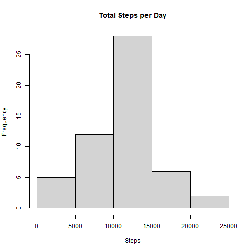
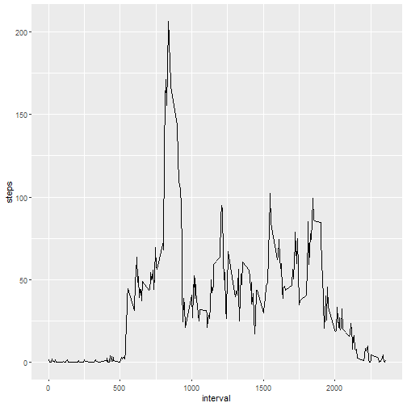
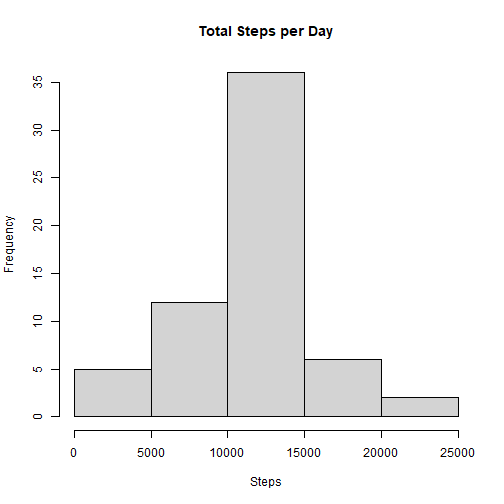
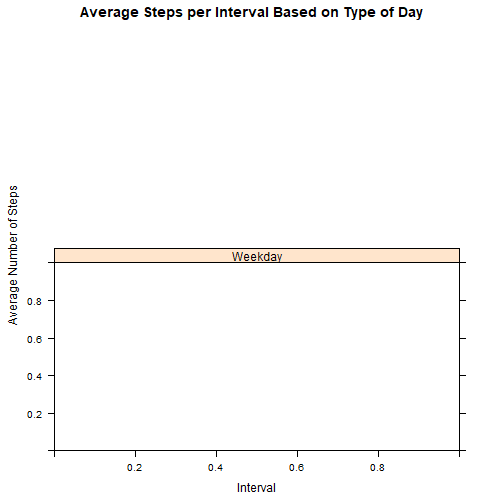

## R Markdown

Reading the dataframe(assuming it's on the same folder)


```r
df <- read.csv("activity.csv")
```

## Including Plots

Aggregate total steps in each day and produce the histogram


Mean and median steps taken each day

```r
as.integer(mean(aux$steps))
```

```
## [1] 10766
```

```r
as.integer(median(aux$steps))
```

```
## [1] 10765
```
Number of steps per interval

```r
aux <- aggregate(steps ~ interval, data=df, mean)

ggplot(aux,aes(x=interval,y=steps))+geom_line()
```



Interval with the highest average steps

```r
aux <- aggregate(steps ~ interval, data=df, mean)
aux[which.max(aux2$steps),]
```

```
##     interval    steps
## 104      835 206.1698
```
Missing values will be inputed using mean

```r
merge <- df
merge$steps[is.na(df$steps)] <- mean(merge$steps, na.rm = TRUE)
summary(merge)
```

```
##      steps            date              interval     
##  Min.   :  0.00   Length:17568       Min.   :   0.0  
##  1st Qu.:  0.00   Class :character   1st Qu.: 588.8  
##  Median :  0.00   Mode  :character   Median :1177.5  
##  Mean   : 37.38                      Mean   :1177.5  
##  3rd Qu.: 37.38                      3rd Qu.:1766.2  
##  Max.   :806.00                      Max.   :2355.0
```
Histogram of total steps each day

```r
aux <- aggregate(steps ~ date, data=merge, sum)
hist(aux$steps, breaks=5, xlab="Steps", main = "Total Steps per Day")
```



```r
library(lattice)
merge <- df
merge$DayCategory <- ifelse(merge$date %in% c("Saturday", "Sunday"), "Weekend", "Weekday")

aux <- ddply(merge , .(interval, DayCategory), summarize, Avg = mean(steps))

xyplot(Avg~interval|DayCategory, data=aux, type="l",  layout = c(1,2),
       main="Average Steps per Interval Based on Type of Day", 
       ylab="Average Number of Steps", xlab="Interval")
```



